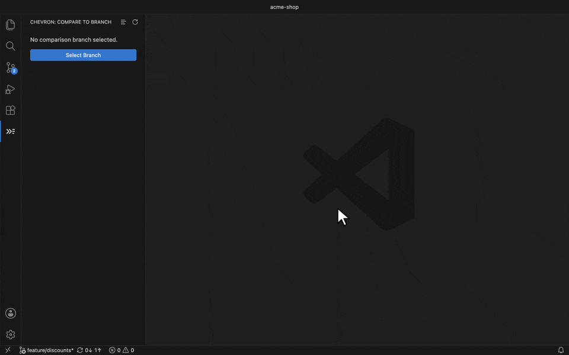
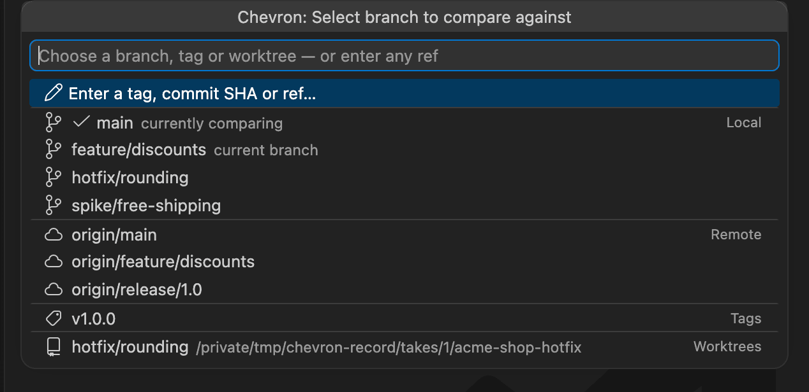
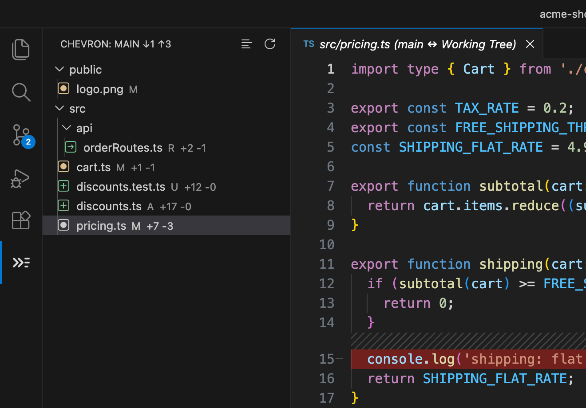
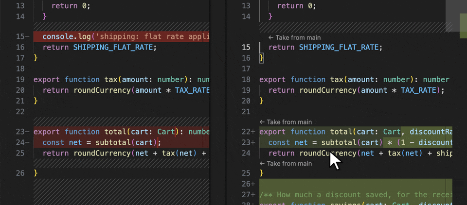
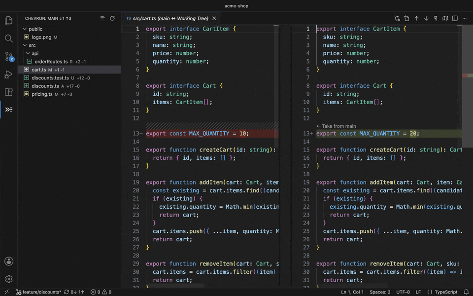
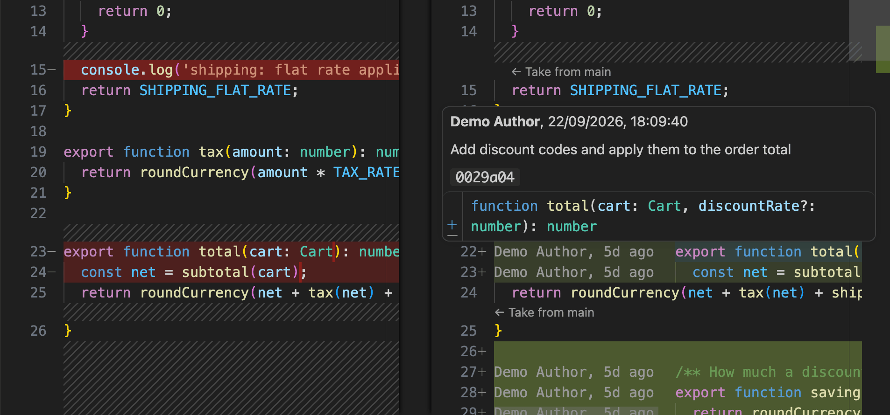

# Chevron — Compare With Branch, IntelliJ-style

**Diff against any branch, tag or commit, and take changes across hunk by hunk.**
No account, no AI, no Pro tier, no telemetry.

Pick a branch, tag or commit. Chevron shows every file you've changed since you diverged from it,
opens each one in VS Code's own diff editor, and puts a **`← Take from main`** action on every
changed block, so you can pull the branch's version of just that hunk back into your working file.

## Getting started

1. Open a folder that's in a git repository.
2. Click the **Chevron** icon in the Activity Bar. Chevron picks `origin/HEAD`, `main` or `master`
   to compare against; run **Chevron: Select Branch to Compare** to choose any other branch, tag or
   commit.
3. Click a file to open its diff, then use **`← Take from main`** above any changed block, or
   `Alt+F7` to walk through every change.

## Why Chevron

If you've come from IntelliJ, WebStorm, PyCharm or Rider, you know the workflow: *Git → Compare
with Branch*, a list of changed files, a side-by-side diff, and a `«` chevron to take a block back.
VS Code has most of the pieces but not that flow. Chevron is that flow and nothing else.

If you want AI agents, a Kanban board and a full git client, install GitLens; Chevron does one thing.

| | Chevron | GitLens | Typical "branch diff" extensions |
|---|---|---|---|
| Changed-files tree vs any branch/tag/SHA | ✓ | ✓ (inside a larger UI) | ✓ |
| Merge-base ("three-dot") diffing | ✓ | ✓ | some |
| **`← Take from <branch>` on every hunk, stale-checked, one undo step** | **✓** | —¹ | —¹ |
| Jump to next change *across files* | ✓ | — | — |
| Compare against another worktree, live | ✓ | — | — |
| Account / Pro tier / telemetry | none | account for some features | varies |

¹ VS Code's diff editor itself has a small "Revert Block" arrow in the gutter of any editable
diff, and it works in Chevron's diffs too. Chevron adds a labelled action on every hunk that names
the branch it takes from, a keyboard route, and a check that refuses to apply to a file that changed
underneath it.

## Features

### Compare with any branch, tag or commit
**Chevron: Select Branch to Compare** lists local branches, remote-tracking branches, tags and
other worktrees, grouped and searchable — or choose **Enter a tag, commit SHA or ref…** and paste
anything `git rev-parse` understands. The branch you're comparing against sorts to the top.

Diffs are **merge-base ("three-dot")**: you see only what changed on *your* side since you diverged,
not everything that has landed on theirs since.

### Changed files at a glance
The **Chevron** view in the Activity Bar lists every changed file, coloured like VS Code's own
Source Control (added, modified, deleted, renamed, untracked), each with its `+added −deleted` line
counts. The header shows how far you've diverged, e.g. `main ↓3 ↑5`. It refreshes itself after a
save, commit, checkout or pull. Right-click a file to copy its path or reveal it in the Explorer.

### ← Take from branch
In a Chevron diff, each changed block in your working file gets a **`← Take from <branch>`** action.
Click it and that block is replaced with the branch's version — additions removed, deletions
restored, modifications reverted. It's one edit (one `Ctrl/Cmd+Z` undoes it), it doesn't save the
file, and it refuses to apply if the file changed underneath it, rather than guessing.

> VS Code hides CodeLens actions in diff editors by default. The first time you open a Chevron diff,
> Chevron offers to turn on `diffEditor.codeLens` for you.

### Walk every change, across files
**Chevron: Next Change** / **Previous Change** (`Alt+F7` / `Shift+Alt+F7`) jump hunk by hunk and roll
over into the next changed file when you reach the end of one — IntelliJ's F7, across the whole
comparison.

### Blame, where it helps
Hover any line on either side of a Chevron diff for author, date, commit summary and hash.
**Chevron: Toggle Blame Annotations** adds a compact `author, 3d ago` label to each *changed*
line of your working file.

### Multi-root workspaces
Open several folders or repositories and each keeps its own comparison. The view follows the repository
of the file you're editing; **Chevron: Select Repository** switches explicitly.

### Worktrees
Other worktrees (`git worktree add`) appear in the picker. Choosing one compares **live**, directly
against that worktree's files on disk, uncommitted edits and untracked files included.

## Commands and keybindings

| Command | Default keybinding |
|---|---|
| Chevron: Select Branch to Compare | — |
| Chevron: Diff Current File Against Branch | `Ctrl+K Shift+D` / `Cmd+K Shift+D` |
| Chevron: Show Changed Files (Project) | — |
| Chevron: Next Change | `Alt+F7` |
| Chevron: Previous Change | `Shift+Alt+F7` |
| Chevron: Take Change Under Cursor from Branch | `Ctrl+K Shift+T` / `Cmd+K Shift+T` |
| Chevron: Toggle Blame Annotations | `Ctrl+K Shift+B` / `Cmd+K Shift+B` |
| Chevron: Select Repository (multi-repo workspaces only) | — |

Next/Previous Change are active only while a comparison is selected and an editor has focus. On some
Linux desktops Alt+F7 is the window manager's "move window" shortcut; rebind it in
*Keyboard Shortcuts* if so.

## Settings

| Setting | Default | What it does |
|---|---|---|
| `chevron.defaultComparisonBranch` | `""` | Ref to compare against automatically when a repository has none selected yet. Empty means: whatever `origin/HEAD` points at, then `main`, then `master`. Never the branch you have checked out (that becomes `origin/<branch>`). Can be set per folder. |
| `chevron.autoSelectComparisonBranch` | `true` | Pick a comparison branch automatically for a repository that has none, instead of waiting for you to choose. |
| `chevron.blame.annotationsEnabledByDefault` | `false` | Show blame annotations beside changed lines when VS Code starts. The toggle command still switches them per session. |
| `chevron.blame.dateFormat` | `"relative"` | `"relative"` (`3mo ago`) or `"absolute"` (`2026-06-14`) in annotations. Hover always shows the full date. |
| `chevron.showUntrackedFiles` | `true` | Include untracked files in the view and in change navigation. |
| `chevron.treeLayout` | `"tree"` | `"tree"` (nested folders) or `"list"` (flat, with each file's folder beside it). Also toggled from the view's title bar. |
| `chevron.takeFromBranch.enabled` | `true` | Show `← Take from <branch>` above each change in Chevron's diffs. |

## Known limitations

- **No automatic fetch.** Chevron compares against your local copy of remote branches; run
  `git fetch` to see what's new upstream.
- **Worktree comparisons** have no rename detection and no ahead/behind counts — two working
  directories don't have a single divergence point the way two branches do.
- **Hunk boundaries** for `← Take from` are computed by Chevron and can occasionally split a change
  differently from how VS Code's diff editor draws it.
- **Encodings and Git LFS.** The branch side is read as UTF-8, without git's filters — files stored
  in another encoding, or through Git LFS, aren't supported by the diff or `← Take from`.

## Deliberately not in scope

Chevron stays small on purpose: no PR review, AI features, accounts, "open on GitHub" links or
custom diff renderer. VS Code and other extensions already do those well.

## Privacy

Chevron collects nothing and sends nothing. It has no telemetry and makes no network requests; it
runs your local `git` and nothing else.

## Feedback and contributing

Bug reports and feature requests: [GitHub Issues](https://github.com/MJEvansDev/chevron/issues).
Building, testing and releasing: [CONTRIBUTING.md](https://github.com/MJEvansDev/chevron/blob/main/CONTRIBUTING.md).
Licensed [MIT](https://github.com/MJEvansDev/chevron/blob/main/LICENSE).
